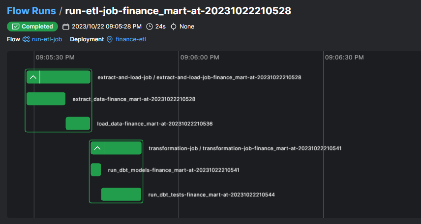

# Prefect & DBT ETL Template

🚧 **PROJECT STATUS:** This project is still under development and not finished yet. 🚧

## Overview

This template provides a foundation for orchestrating ETL processes using Prefect and DBT. While primarily designed as a template, it includes a basic configuration for immediate experimentation, making it ideal for both developers new to ETL and those looking to streamline their setup.





## Directory Structure

- **`/utils`**: Utility modules and helper functions.
- **`/transformation/dbt/{data-mart}`**: DBT transformations for specific data mart or product. An example; "finance_mart", is provided.
- **`/flows/{data-mart}`**: Prefect flows for specific data mart or product.
- **`/config/dbt`**: Contains DBT config files like `dbt_project.yml`.

**Note**: Ensure to update the `model-paths` variable in `config/dbt/dbt_project.yml` to match the folders in the `transformation` directory.

## Environment Setup

Included at the root is a `docker-compose.yaml` that sets up:

- **Postgres**: The main relational database.
- **pgAdmin**: A web-based admin tool for Postgres.
- **Grafana**: A platform for monitoring and observability.

The DBT config files have a default configuration targeting the Postgres service in this setup. However, you can adjust this to connect to your preferred database environment.

To launch the services:
```bash
docker-compose up -d
```

## Getting Started

1. **Setup the Environment**: 
    - Ensure you have Prefect and DBT installed:
      ```bash
      pip install prefect dbt
      ```

2. **DBT Setup**: 
    - Navigate to the `config/dbt` directory and configure your `dbt_project.yml`.
    - Remember to set the `model-paths` variable to match your transformation folders.

3. **Prefect Setup**: 
    - Navigate to the `flows/{data-mart}` directory. This contains a template for your Prefect ETL flow. Modify it according to your needs.

4. **Utility Functions**: 
    - The `utils/` folder contains various utility modules and functions which can be used throughout the ETL process. Extend or modify as necessary.

## Usage

1. **Run Prefect Flow**: 
    - The template comes with an example ETL flow named `flow.py`. To run this Prefect flow:
      ```bash
      prefect run -p flows/finance-mart/flow.py
      ```


## Contribution

Contributions are always welcome! If you'd like to contribute, please fork the repository and use a feature branch. Pull requests are warmly welcome.

## License

This project is licensed under the MIT License - see below for details.

---


## Disclaimer

While we aim to provide a reliable template, ensure to review, test, and adjust the code as per your needs before deploying in any production setting.

---

**GitHub Repository**: [https://github.com/MartinsAlex/prefect-dbt-template](#)

